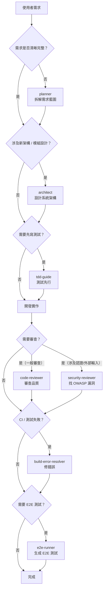

# AI 配置知識庫

> 本專案是所有 AI 提示詞、技能與代理設定的**單一真相來源（Single Source of Truth）**。
> 任何對 `~/.claude/` 的永久性變更，都應同步更新此 repo。

---

## 目錄結構

```
ai-config/
├── CLAUDE.md               # 全域規則與核心行為約束
├── settings.json           # Claude Code 全域設定（權限、MCP 等）
├── agents/                 # 子代理（SubAgent）定義
├── skills/                 # 技能（Skill）定義
├── commands/               # 自訂斜線指令（Slash Commands）
└── hooks/                  # 掛鉤腳本（Hooks）
```

| 目錄 | 職責 | 載入方式 |
|------|------|---------|
| `agents/` | 定義具有獨立職責、工具權限與系統提示的子代理 | Claude Code 自動掃描 `.claude/agents/` |
| `skills/` | 可按需載入的專業知識模組（含 SKILL.md） | `Skill` 工具呼叫 |
| `commands/` | 使用者可在對話中用 `/xxx` 呼叫的自訂指令 | `/指令名稱` 觸發 |
| `hooks/` | 在特定事件（如 context 滿載）自動執行的 shell 腳本 | Claude Code 事件系統 |

---

## AI 工作流程總覽

主 agent 永遠只負責**路由**（判斷委派給誰），不直接執行任何領域工作。



### 主 Agent 委派限制

- 不得執行任何屬於 subAgent 職責範圍的工作
- 同時啟動的 subAgent **不超過 2 個**（避免 context 爆炸）
- 未收到 subAgent 完整輸出前，不啟動下一個委派

---

## SubAgent 一覽表

| Agent | 職責 | 不做 | Model |
|-------|------|------|-------|
| `planner` | 將模糊需求轉化為可執行任務清單與開發藍圖 | 不寫程式碼、不做架構決策 | sonnet |
| `architect` | 設計架構、資料模型、分層結構、介面契約 | 不寫實作程式碼、不執行測試 | opus |
| `tdd-guide` | 先寫測試案例，定義驗收標準 | 不寫業務邏輯、不修改通過測試後的原始碼 | sonnet |
| `code-reviewer` | 審查 git diff，依 SOLID、效能、命名等維度評分 | 不修改被審查的程式碼 | opus |
| `security-reviewer` | 專注 OWASP Top 10、認證授權缺陷、敏感資料暴露 | 不做一般程式碼品質審查 | opus |
| `build-error-resolver` | 讀取錯誤日誌，定位根因，提出最小範圍修復方案 | 不重構無關程式碼、不添加新功能 | sonnet |
| `e2e-runner` | 根據功能規格生成 E2E 測試腳本 | 不測試單元層邏輯、不修改業務程式碼 | sonnet |

現有 agents（已內建）：

| Agent | 職責 |
|-------|------|
| `code-reviewer` | 結構化程式碼審查，與 master 分支 diff，產出評分報告 |
| `critical-analyst` | 多維度批判分析技術提案、架構決策、程式碼實作 |
| `planning-specialist` | 將功能需求轉換為可執行技術規格文件 |
| `prompt-optimizer` | 優化、結構化並注入專案上下文至提示詞 |

---

## Model 選擇策略

| 情境 | 模型 | 理由 |
|------|------|------|
| 日常功能開發、錯誤修復、E2E 生成、TDD 引導、需求拆解 | `sonnet` | 效能與成本的最佳平衡點 |
| 架構設計、程式碼審查、資安審查 | `opus` | 需要深度推理能力 |
| 瑣碎資訊整理、格式轉換、簡單問答 | `haiku` | 最低成本，適合輔助性工作 |

### `/compact` 使用規則（強制）

- 只在**功能完整實作並通過驗證後**才執行 `/compact`
- **禁止**在任務進行中、測試紅燈時、代理尚未輸出結果時使用
- 主 agent 在委派子代理前若 context 已滿，先完成當前委派後再清理

---

## 新增 SubAgent 指南

### frontmatter 格式規範

```yaml
---
name: {kebab-case 名稱}
description: "{一句話說明觸發時機}\n\n**觸發範例**：\n\n<example>\nContext: {情境說明}\n\nuser: \"{使用者輸入}\"\n\nassistant: \"{助理回應}\"\n\n<commentary>\n{為什麼這個 agent 適合此情境}\n</commentary>\n</example>"
tools: {逗號分隔的工具清單}
model: haiku|sonnet|opus
color: {顏色名稱}
---
```

### 系統提示範本

```markdown
你是 {專案/領域} 的 {角色名稱} 專家。你的唯一職責是：{一句話職責描述}。

## 核心職責

1. **{主要工作}**：{具體說明}
2. **{次要工作}**：{具體說明}

## 你不做的事

- 不做 {職責邊界 1}（交給 @{其他 agent}）
- 不做 {職責邊界 2}

## 執行流程

### 步驟 1：{初始化}
{具體步驟}

### 步驟 2：{主要工作}
{具體步驟}

### 步驟 3：{輸出}
{輸出規格}

## 輸出規格

{說明輸出格式、必要欄位、命名規則}

## 禁止事項

- 禁止 {行為 1}
- 禁止 {行為 2}
```

### 可用工具清單（按最小權限原則選擇）

| 類型 | 工具 | 用途 |
|------|------|------|
| 讀取 | `Read, Glob, Grep` | 讀取程式碼與檔案 |
| 寫入 | `Write, Edit` | 建立或修改檔案 |
| 執行 | `Bash` | 執行 shell 指令 |
| 網路 | `WebSearch, WebFetch` | 查詢外部資源 |
| IDE | `mcp__ide__getDiagnostics` | 取得 IDE 診斷資訊 |
| Notion | `mcp__notion__*` | 讀寫 Notion 頁面 |
| 技能 | `Skill` | 載入其他 Skills |
| 任務 | `TaskCreate, TaskGet, TaskUpdate, TaskList` | 管理任務清單 |

---

## 同步說明

此 repo 是 `~/.claude/` 的**版本化快照**。當你修改 `~/.claude/` 下的任何設定後，請同步更新此 repo 並建立 commit：

```bash
cd ~/doc/ai-config
# 複製更新的檔案
cp ~/.claude/CLAUDE.md ./CLAUDE.md
cp ~/.claude/settings.json ./settings.json
# ... 依需要複製其他檔案

git add .
git commit -m "chore: sync ~/.claude changes — {簡述變更}"
```
