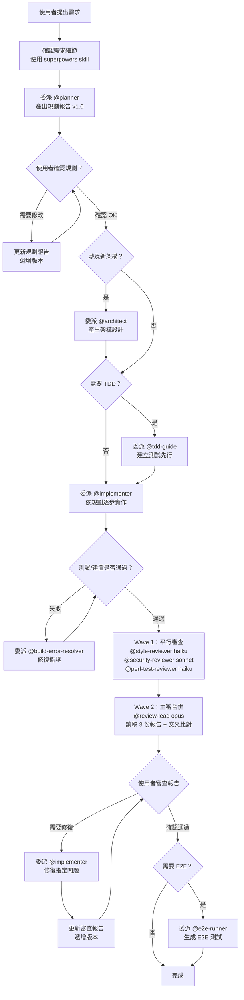

# AI 配置知識庫

> 本專案是所有 AI 提示詞、技能與代理設定的**單一真相來源（Single Source of Truth）**。
> 任何對 `~/.claude/` 的永久性變更，都應同步更新此 repo。

---

## 目錄結構

```
ai-config/
├── CLAUDE.md               # 全域規則與核心行為約束
├── settings.json           # Claude Code 全域設定（權限、MCP 等）
├── agents/                 # 子代理（SubAgent）定義
├── skills/                 # 技能（Skill）定義
├── commands/               # 自訂斜線指令（Slash Commands）
└── hooks/                  # 掛鉤腳本（Hooks）
```

| 目錄 | 職責 | 載入方式 |
|------|------|---------|
| `agents/` | 定義具有獨立職責、工具權限與系統提示的子代理 | Claude Code 自動掃描 `.claude/agents/` |
| `skills/` | 可按需載入的專業知識模組（含 SKILL.md） | `Skill` 工具呼叫 |
| `commands/` | 使用者可在對話中用 `/xxx` 呼叫的自訂指令 | `/指令名稱` 觸發 |
| `hooks/` | 在特定事件（如 context 滿載）自動執行的 shell 腳本 | Claude Code 事件系統 |

---

## 開發工作流程（完整生命週期）

主 agent 永遠只負責**路由**（判斷委派給誰），不直接執行任何領域工作。

### 流程總覽



### 三個階段與版本化報告

#### 階段一：規劃與討論（程式碼不動）

1. 使用者提出需求
2. 主 agent 使用 `superpowers` skill 確認需求細節
3. 委派 **@planner** 產出規劃報告（`/tmp/planning-report-latest.md`）
4. 使用者與 AI 反覆討論，每次修改遞增版本號（v1.0 → v1.1 → v2.0...）
5. **使用者明確說「開始實作」後，才進入下一階段**

> 若涉及架構決策，中途委派 **@architect** 產出架構設計文件，整合回規劃報告。
> 若需技術規格細化，委派 **@planning-specialist**（既有代理）產出技術規格。

#### 階段二：實作（依據已確認的規劃）

1. 若採用 TDD，先委派 **@tdd-guide** 建立測試
2. 委派 **@implementer** 依規劃報告逐步實作
3. 測試/建置失敗時，委派 **@build-error-resolver** 定位根因與修復
4. 功能完成時，委派 **@e2e-runner** 建立 E2E 測試（若需要）

#### 階段三：多角度審查與修復（程式碼凍結）

審查採用 **兩波次（Wave 1 + Wave 2）** 架構，多角度交叉比對：

**Wave 1（平行，3 個專項審查員）**：
1. 委派 **@style-reviewer**（haiku）— 程式碼品質 + 編碼規範
2. 委派 **@security-reviewer**（sonnet）— OWASP Top 10 + 安全漏洞
3. 委派 **@perf-test-reviewer**（haiku）— 效能 + 可測試性

**Wave 2（接續，1 個主審）**：
4. 委派 **@review-lead**（opus）— SOLID + 功能正確性 + 讀取 3 份報告交叉比對 → 產出最終合併報告（`/tmp/code-review-latest.md`）

**使用者決策**：
5. 使用者閱讀合併報告，**判斷哪些問題需要修復**
6. 委派 **@implementer** 修復 → **@review-lead** 更新報告版本
7. 反覆至使用者確認通過

### 版本記錄規範

所有規劃報告與審查報告都必須包含版本記錄表：

```markdown
## 版本記錄

| 版本 | 更新時間 | 變更摘要 |
|------|---------|---------|
| v1.0 | 2026-03-16 14:00 | 初版規劃 |
| v1.1 | 2026-03-16 15:30 | 根據討論調整：移除 X 功能、新增 Y 欄位 |
| v2.0 | 2026-03-17 10:00 | 重大修訂：改採方案 B 架構 |
```

**版本號規則**：
- `v1.0` → `v1.1`：小幅調整（措辭、補充、微調）
- `v1.x` → `v2.0`：重大變更（架構改動、功能增刪、方案替換）

---

## 主 Agent 委派限制

- 不得執行任何屬於 subAgent 職責範圍的工作
- 同時啟動的 subAgent **不超過 4 個**（避免 context 爆炸）
- 未收到 subAgent 完整輸出前，不啟動下一個委派
- **規劃未經使用者確認前，禁止異動程式碼**
- **審查報告中的修復項目，由使用者決定哪些需要修復**

---

## SubAgent 一覽表

### 開發流程團隊

| Agent | 職責 | Model | 觸發時機 |
|-------|------|-------|---------|
| `planner` | 需求拆解、規劃報告、版本化討論管理 | sonnet | 新功能需求、Epic 級工作 |
| `implementer` | 依規劃報告撰寫/修改/修復程式碼 | sonnet | 規劃確認後進入實作階段 |
| `architect` | 架構設計、資料模型、分層結構、ADR | opus | 涉及新模組、跨服務整合 |
| `tdd-guide` | TDD 引導、測試案例先行、驗收標準 | sonnet | 規劃確認後、實作前 |
| `build-error-resolver` | 錯誤日誌分析、根因定位、最小修復 | sonnet | CI 失敗、測試紅燈 |
| `e2e-runner` | E2E 測試腳本生成、覆蓋矩陣 | sonnet | 功能完成、驗收前 |

### 審查團隊（Wave 1 + Wave 2）

| Agent | 審查維度 | 權重 | Model | 波次 |
|-------|---------|------|-------|------|
| `style-reviewer` | 程式碼品質 + 編碼規範 | 20% + 15% = 35% | **haiku** | Wave 1（平行） |
| `security-reviewer` | 安全性（OWASP Top 10） | 15% | **sonnet** | Wave 1（平行） |
| `perf-test-reviewer` | 效能 + 可測試性 | 5% + 5% = 10% | **haiku** | Wave 1（平行） |
| `review-lead` | SOLID + 功能正確性 + **交叉比對合併** | 25% + 15% = 40% | **opus** | Wave 2（接續） |

**交叉比對**：review-lead 在 Wave 2 讀取 3 份 Wave 1 報告，發現跨維度複合問題時升級嚴重度（如：style 發現方法過長 + perf-test 發現無測試 → 🔴 升級）。

### 輔助 agents

| Agent | 職責 | Model | 對應指令 |
|-------|------|-------|---------|
| `critical-analyst` | 多維度批判分析技術提案、架構決策 | inherit | `/critique` |
| `planning-specialist` | 需求→技術規格（Gap Analysis / Implementation Plan） | inherit | `/plan` |
| `prompt-optimizer` | 提示詞結構化、專案上下文注入 | inherit | `/prompt-optimize` |

### agents 分工說明

| 場景 | 使用 | 不使用 | 原因 |
|------|------|--------|------|
| 新功能需求討論 | `planner` | `planning-specialist` | planner 管理需求討論流程與版本化報告 |
| 技術規格細化 | `planning-specialist` | `planner` | planning-specialist 專注技術規格產出 |
| 架構方案設計 | `architect` | `critical-analyst` | architect 做前期設計；critical-analyst 做事後批判 |
| 架構方案評審 | `critical-analyst` | `architect` | critical-analyst 批判已有方案的邏輯健全性 |
| 程式碼審查 | 審查團隊 4 人 | 單一 reviewer | 多角度 + 交叉比對，品質更高、成本更低 |
| 程式碼實作 | `implementer` | 主 agent | 主 agent 不直接寫程式碼 |
| 審查後修復 | `implementer` | 主 agent | 使用者決定修復項目後，委派 implementer 修復 |

---

## Model 選擇策略

| 情境 | 模型 | 理由 |
|------|------|------|
| 日常功能開發、錯誤修復、E2E 生成、TDD 引導、需求拆解、安全審查 | `sonnet` | 效能與成本的最佳平衡點 |
| 架構設計、審查主審（SOLID + 交叉比對）、批判分析 | `opus` | 需要深度推理能力 |
| 程式碼風格審查、效能/測試覆蓋審查、瑣碎資訊整理 | `haiku` | 最低成本，適合機械性檢查 |

### SubAgent 統一輸出規範

所有子代理的報告統一寫入 `/tmp/`，命名規則如下：

| Agent | 輸出路徑 | 說明 |
|-------|---------|------|
| `planner` | `/tmp/planning-report-latest.md` | 規劃報告（含版本記錄） |
| `architect` | `/tmp/architecture-design-latest.md` | 架構設計文件 |
| `implementer` | `/tmp/implementation-latest.md` | 實作摘要 |
| `tdd-guide` | 直接寫入專案 `tests/` 目錄 | 測試檔案 |
| `style-reviewer` | `/tmp/review-style-latest.md` | Wave 1：品質+風格報告 |
| `security-reviewer` | `/tmp/review-security-latest.md` | Wave 1：安全報告 |
| `perf-test-reviewer` | `/tmp/review-perf-test-latest.md` | Wave 1：效能+測試報告 |
| `review-lead` | `/tmp/code-review-latest.md` | Wave 2：最終合併報告（含版本記錄） |
| `build-error-resolver` | 對話內直接回報 | 修復報告 |
| `e2e-runner` | 直接寫入專案 `tests/` 目錄 | E2E 測試檔案 |
| `critical-analyst` | `/tmp/critical-analysis-latest.md` | 批判分析報告 |
| `planning-specialist` | `/tmp/planning-latest.md` | 技術規格文件 |

每個子代理在完成工作後，必須在輸出末尾附上「**後續可能需要的代理**」段落，列出建議的下一步（不指揮主 agent，僅供參考）。

### `/compact` 使用規則（強制）

- 只在**功能完整實作並通過驗證後**才執行 `/compact`
- **禁止**在任務進行中、測試紅燈時、代理尚未輸出結果時使用
- 主 agent 在委派子代理前若 context 已滿，先完成當前委派後再清理

---

## 新增 SubAgent 指南

### frontmatter 格式規範

```yaml
---
name: {kebab-case 名稱}
description: "{一句話說明觸發時機}\n\n**觸發範例**：\n\n<example>\nContext: {情境說明}\n\nuser: \"{使用者輸入}\"\n\nassistant: \"{助理回應}\"\n\n<commentary>\n{為什麼這個 agent 適合此情境}\n</commentary>\n</example>"
tools: {逗號分隔的工具清單}
model: haiku|sonnet|opus
color: {顏色名稱}
---
```

### 系統提示範本

```markdown
你是 {專案/領域} 的 {角色名稱} 專家。你的唯一職責是：{一句話職責描述}。

## 核心職責

1. **{主要工作}**：{具體說明}
2. **{次要工作}**：{具體說明}

## 你不做的事

- 不做 {職責邊界 1}（交給 @{其他 agent}）
- 不做 {職責邊界 2}

## 執行流程

### 步驟 1：{初始化}
{具體步驟}

### 步驟 2：{主要工作}
{具體步驟}

### 步驟 3：{輸出}
{輸出規格}

## 輸出規格

{說明輸出格式、必要欄位、命名規則}

## 禁止事項

- 禁止 {行為 1}
- 禁止 {行為 2}
```

### 可用工具清單（按最小權限原則選擇）

| 類型 | 工具 | 用途 |
|------|------|------|
| 讀取 | `Read, Glob, Grep` | 讀取程式碼與檔案 |
| 寫入 | `Write, Edit` | 建立或修改檔案 |
| 執行 | `Bash` | 執行 shell 指令 |
| 網路 | `WebSearch, WebFetch` | 查詢外部資源 |
| IDE | `mcp__ide__getDiagnostics` | 取得 IDE 診斷資訊 |
| Notion | `mcp__notion__*` | 讀寫 Notion 頁面 |
| 技能 | `Skill` | 載入其他 Skills |
| 任務 | `TaskCreate, TaskGet, TaskUpdate, TaskList` | 管理任務清單 |

---

## 同步說明

此 repo 是 `~/.claude/` 的**版本化快照**。當你修改 `~/.claude/` 下的任何設定後，請同步更新此 repo 並建立 commit：

```bash
cd ~/doc/ai-config
# 複製更新的檔案
cp ~/.claude/CLAUDE.md ./CLAUDE.md
cp ~/.claude/settings.json ./settings.json
# ... 依需要複製其他檔案

git add .
git commit -m "chore: sync ~/.claude changes — {簡述變更}"
```
