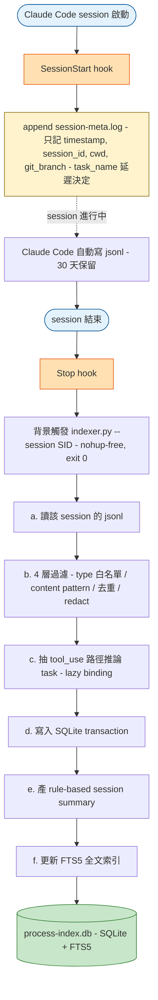
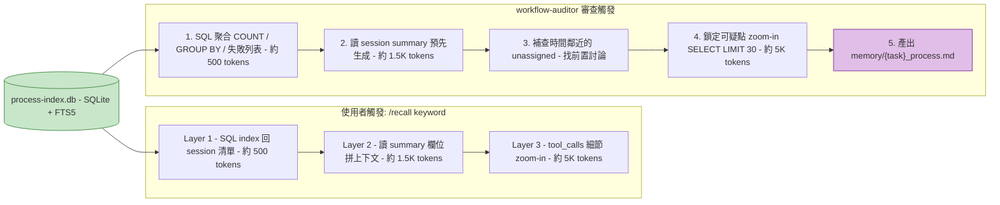

# Process Index Design — Session 過程索引器

**目標**：解決「跨多個 session 完成的大型任務，workflow-auditor 審查時失去前面 session 細節」的痛點。

**限制**：使用者走訂閱制（無 Anthropic API key）→ 不能用 claude-mem（Agent SDK 不支援訂閱計費）→ 必須自建，且**禁用 LLM per-message 處理**。

**日期**：2026-04-18
**狀態**：設計確認中，待進 Phase 1 實作

---

## 1. 為什麼要做

### 1.1 痛點鏈

1. 使用者記憶系統（`~/.claude/memory/`）是**主動精選式**，只記結論
2. `compact-notes/`、`current-stage.txt`、`docs/` 是**手動決定點**的 snapshot
3. 結果：**過程**（tool call 序列、失敗重試、探索路徑）無法跨 session 還原
4. 大型任務常跨 5+ sessions，最後 workflow-auditor 只看到最後一個 session 的 jsonl

### 1.2 為什麼 Claude Code 的 jsonl 是唯一資料源

- 已存在：`~/.claude/projects/{encoded-cwd}/*.jsonl`
- 包含：**你的原始 prompt + Claude 的文字回覆 + 所有 tool_use + tool_result**（實測逐字保留，非摘要）
- 不包含：Claude 的 thinking（API 規格，加密 signature，**任何工具都拿不到**）
- 限制：預設保留 30 天，超過自動清理（本專案接受此限制）

### 1.3 為什麼不用 claude-mem

| 原因 | 說明 |
|---|---|
| 訂閱計費限制 | Agent SDK 明確禁用 Pro/Max 訂閱，只接受 API key |
| 哲學衝突 | 自動採集 vs 主動精選 |
| Hook 疊加風險 | `PostToolUse *` 每次 tool call 觸發 SDK 壓縮 |
| 資料重複 | jsonl 已是 ground truth，claude-mem 再 derive 一次 |

---

## 2. 資料流全景

### 2.1 寫入流（Passive, 每 session 自動）



### 2.2 讀取流（Active, 使用者或 auditor 觸發）



**關鍵紀律**：永遠不 `Read` 原始 jsonl，永遠不 `SELECT * FROM tool_calls` without `WHERE`，一次審查控制在 10-15K tokens 內。

---

## 3. 節點設計與判斷邏輯

### 3.1 節點 A — SessionStart hook

**位置**：`~/.claude/settings.json`
**腳本**：`~/.claude/scripts/session-meta.sh`

#### 職責（只做一件事）

append 一筆 metadata 到 `~/.claude/session-meta.log`：

```
timestamp \t session_id \t cwd \t git_branch
```

#### 設計動機

- **最小化**：hook 執行時間必須 < 50ms，不 block session 啟動
- **Lazy binding**：**不嘗試寫 task_name**。理由：
  - 全新需求 session 一開始根本沒 task 目錄
  - 舊的 task 目錄會誤判（抓到 mtime 最新但不相干的）
  - task 識別改由 indexer 用 **session 實際觸及的路徑** 推論

#### 判斷邏輯

```bash
# 失敗一律 exit 0，不阻塞 Claude Code
set +e
session_id="${CLAUDE_SESSION_ID:-unknown}"
cwd="$PWD"
git_branch=$(git -C "$cwd" branch --show-current 2>/dev/null || echo "")

printf '%s\t%s\t%s\t%s\n' \
  "$(date +%s)" "$session_id" "$cwd" "$git_branch" \
  >> ~/.claude/session-meta.log
exit 0
```

---

### 3.2 節點 B — Stop hook → indexer 觸發

**位置**：`~/.claude/settings.json`
**動作**：背景觸發 `~/.claude/scripts/index_transcripts.py --session $SID`

#### 設計動機

- **背景執行**：不讓 indexer 拖慢 session 結束
- **per-session 觸發**：只處理剛結束的 session，快速（< 5s）
- **Idempotent**：同 session 重跑不會 duplicate（靠 `message_uuid UNIQUE`）
- **失敗不重試**：失敗時 log 到 `/tmp/indexer-$SID.log`，手動 `/reindex $SID` 補

```json
{
  "type": "command",
  "command": "python3 ~/.claude/scripts/index_transcripts.py --session ${CLAUDE_SESSION_ID} > /tmp/indexer-${CLAUDE_SESSION_ID}.log 2>&1 &",
  "timeout": 5
}
```

---

### 3.3 節點 C — indexer Python 腳本

**位置**：`~/.claude/scripts/index_transcripts.py`

#### 輸入模式（CLI 參數）

| 參數 | 用途 | 時機 |
|---|---|---|
| `--session <sid>` | 只處理一個 session | Stop hook 自動 |
| `--since <days>` | 索引 N 天內所有未入庫 session | 手動補跑 |
| `--all --rebuild` | 全量重建 | Schema 升級時 |

#### 核心流程（6 步）

1. **讀參數 + 定位 jsonl 檔案**
   - scan `~/.claude/projects/*/<session>.jsonl`（5 個 project dir 都要找）
2. **解析 jsonl 逐行處理**
   - 對每行 record 做 4 層過濾
3. **抽取有效內容**
   - user 真實 prompt / assistant text / tool_use / tool_result
4. **推論 task（lazy binding）**
   - 掃所有 `tool_use.input` 的 `file_path` / `command`
   - 用 regex `/\.claude/tasks/([^/]+)/` 抽 task name
   - 無匹配 → task = `"unassigned"`
   - 多匹配 → 全記錄到 `session_tasks`，`primary_task` = 出現最多的
5. **寫入 SQLite（transaction）**
   - `sessions` / `tool_calls` / `user_prompts` / `assistant_texts` / `session_tasks`
   - `INSERT OR IGNORE`（防重）
6. **產 rule-based session summary**（純 SQL，無 LLM）
   - 抓第一個 user prompt / 最後的 assistant text
   - tool name 分布統計
   - 觸及檔案列表（top 5）
   - 失敗 command 數
   - subagent 委派列表
   - 寫入 `sessions.summary` 欄位

#### 關鍵設計決策

**為什麼 rule-based summary 不用 LLM**：
- 訂閱制限制（每次壓縮要另付 API）
- 1 session 可能有上百 tool call，LLM 分類慢
- Rule-based 100% 穩定、可測試、可版控
- 統計性摘要（Tool×N、熱點檔案）本身就是最有資訊密度的摘要

**為什麼 4 層過濾**：
- Layer 1（type 白名單）：直接砍掉 5/7 種 type（file-history-snapshot / attachment / system / last-prompt）
- Layer 2（content pattern）：濾掉 `<system-reminder>` / `<local-command-caveat>` 等 harness 注入（實測一個 session 中這類垃圾占 50%+）
- Layer 3（去重）：SHA256 hash 去同 session 內重複（某些系統注入會多次出現）
- Layer 4（redact）：regex 洗敏感資料（_PASSWORD / _TOKEN / _KEY / _CREDENTIAL / _DSN / ssh-rsa / sk-\*）

這 4 層是**有序且獨立**的，每層都有單元測試（fixture）。

---

### 3.4 節點 D — SQLite Schema

**位置**：`~/.claude/process-index.db`（WAL mode）

#### 主要表

```sql
-- 1. 核心：每個 session 一筆
CREATE TABLE sessions (
  session_id TEXT PRIMARY KEY,
  project_dir TEXT NOT NULL,          -- -home-dev / -home-dev-stars 等
  cwd TEXT,
  git_branch TEXT,
  started_at INTEGER,
  ended_at INTEGER,
  tool_call_count INTEGER,
  file_count INTEGER,
  first_prompt TEXT,                   -- 前 200 字
  last_assistant_text TEXT,            -- 最後一段主代理回覆前 200 字
  primary_task TEXT,                   -- lazy 填入，最頻繁接觸 task
  task_count INTEGER,                  -- 0 = unassigned
  summary TEXT,                        -- rule-based 200-300 字摘要
  jsonl_path TEXT,                     -- 原始 jsonl 位置（供 30 天內回查）
  indexed_at INTEGER
);

-- 2. Session 和 Task 的多對多關聯
CREATE TABLE session_tasks (
  session_id TEXT REFERENCES sessions(session_id) ON DELETE CASCADE,
  task_name TEXT,
  first_touched_at INTEGER,
  tool_touch_count INTEGER,
  PRIMARY KEY (session_id, task_name)
);

-- 3. Tool call 明細
CREATE TABLE tool_calls (
  id INTEGER PRIMARY KEY AUTOINCREMENT,
  session_id TEXT REFERENCES sessions(session_id) ON DELETE CASCADE,
  message_uuid TEXT UNIQUE,
  tool_name TEXT NOT NULL,
  tool_input_snippet TEXT,            -- 500 字截短 + redact
  result_snippet TEXT,                 -- 500 字截短 + redact
  file_path TEXT,                      -- 抽出的檔案路徑（NULL if not file op）
  exit_status INTEGER,                 -- Bash exit code
  occurred_at INTEGER
);

-- 4. 使用者 prompt（真實的，非系統注入）
CREATE TABLE user_prompts (
  id INTEGER PRIMARY KEY AUTOINCREMENT,
  session_id TEXT REFERENCES sessions(session_id) ON DELETE CASCADE,
  prompt_text TEXT,
  occurred_at INTEGER
);

-- 5. Claude 的文字回覆
CREATE TABLE assistant_texts (
  id INTEGER PRIMARY KEY AUTOINCREMENT,
  session_id TEXT REFERENCES sessions(session_id) ON DELETE CASCADE,
  message_uuid TEXT UNIQUE,
  text TEXT,
  occurred_at INTEGER
);

-- 6. 全文搜尋（FTS5）
CREATE VIRTUAL TABLE search_idx USING fts5(
  content,
  session_id UNINDEXED,
  ref_type UNINDEXED,                  -- 'prompt' / 'assistant' / 'tool_call' / 'summary'
  ref_id UNINDEXED,
  tokenize = 'unicode61'
);

-- 索引
CREATE INDEX idx_session_tasks ON session_tasks(task_name, first_touched_at);
CREATE INDEX idx_tool_calls_session ON tool_calls(session_id, occurred_at);
CREATE INDEX idx_tool_calls_file ON tool_calls(file_path);
CREATE INDEX idx_user_prompts_session ON user_prompts(session_id, occurred_at);

-- Schema 版本
CREATE TABLE _schema_version (version INTEGER PRIMARY KEY);
INSERT INTO _schema_version VALUES (1);
```

#### 關鍵設計決策

**為什麼把 assistant_texts 獨立成表**：
- jsonl 保留 Claude 的文字回覆（353 字完整保留已實測）
- 這是最高密度的「我那次做了什麼決定」資訊
- 比 tool_calls 更接近「人類可讀的結論」

**為什麼 session_tasks 用 M:N 關聯**：
- 支援一 session 涉及多 task 的現實情境
- primary_task 存主要那個，但不丟失次要

**為什麼不做 task_artifacts 表**（之前討論撤除的決策）：
- jsonl 已涵蓋子代理透過 Write/Edit 產出的檔案
- `.claude/tasks/{task}/*.md` 可直接 Read，不需 SQL
- 跨 task 全文搜尋頻率低，不值複雜度

---

### 3.5 節點 E — Slash Commands（3 層查詢）

#### Layer 1 — `/recall <keyword>`

**位置**：`~/.claude/commands/recall.md` + `~/.claude/scripts/recall.py`

```sql
SELECT s.session_id, s.primary_task, s.started_at, 
       s.tool_call_count, s.first_prompt
FROM sessions s
JOIN search_idx i ON i.session_id = s.session_id
WHERE search_idx MATCH ?
GROUP BY s.session_id
ORDER BY s.started_at DESC LIMIT 20;
```

**輸出**：表格 ~500 tokens

#### Layer 2 — `/recall-timeline <session_id>`

同 task 的前後 3 個 session，呈現 task 演進。

#### Layer 3 — `/recall-detail <session_id> [filter]`

完整 tool call 序列 + assistant texts 按 timestamp 交錯。

---

### 3.6 節點 F — workflow-auditor 整合

#### 擴充後的審查流程

```
Step 1: SQL 聚合（~500 tokens）
   SELECT COUNT(*), SUM(tool_call_count), MIN/MAX(timestamp)
   SELECT tool_name, COUNT(*) GROUP BY tool_name
   SELECT file_path, COUNT(*) GROUP BY file_path LIMIT 10
   SELECT * FROM tool_calls WHERE exit_status != 0

Step 2: 讀 session summary（~1.5K tokens）
   SELECT summary FROM sessions WHERE primary_task = ?

Step 3: 補查鄰近 unassigned（找前置討論）
   SELECT * FROM sessions 
   WHERE primary_task = 'unassigned' AND cwd = ?
     AND started_at BETWEEN (task_first - 7d) AND task_first

Step 4: 按需 zoom-in（~5K tokens）
   SELECT * FROM tool_calls 
   WHERE session_id = ? AND occurred_at BETWEEN ? AND ?
   LIMIT 30

Step 5: 產出 memory/{task}_process.md
```

#### 強制紀律（加到 @workflow-auditor prompt）

```
ALLOWED_QUERIES:
- SELECT summary FROM sessions WHERE ...
- SELECT COUNT/SUM/MIN/MAX ... FROM ... WHERE ...
- SELECT ... FROM tool_calls WHERE session_id = ? AND ... LIMIT 30
- SELECT ... FROM sessions JOIN session_tasks ON ... WHERE task_name = ?

FORBIDDEN:
- SELECT * FROM tool_calls 不含 WHERE
- 一次撈超過 50 筆 tool_calls
- Read 原始 ~/.claude/projects/*.jsonl
```

---

### 3.7 節點 G — save-context 與本系統共存

**保留 `/save-context`**（不替代）：

| 用途 | `/save-context` | 本系統 |
|---|---|---|
| 給下一個 session 當入場白 | ✅ 直接 Read | ❌ 要 /recall 查 |
| 精煉過的決策摘要 | ✅ | ❌（rule-based 只是統計）|
| 機器可讀的過程事件 | ❌ | ✅ |
| 跨 session 檢索 | ❌ | ✅ |

兩者互補。`/save-context` 產出的 `compact-notes/*.json` **仍用 Read 讀**，不進索引。

---

## 4. 邊界情境處理

| 情境 | 系統行為 |
|---|---|
| 純討論 session，沒碰 tasks 目錄 | primary_task = "unassigned"，workflow-auditor 補查時間鄰近找回 |
| 一 session 涉及多 task | session_tasks 多筆關聯，primary_task 取 tool_touch_count 最高 |
| Session 中途切 git branch | sessions.git_branch 記 SessionStart 當下值，session_tasks 靠路徑推論仍準確 |
| 30 天後 jsonl 消失 | SQLite 摘要永久，`jsonl_path` 欄位顯示 `<EXPIRED>`，但無法再補 zoom-in |
| indexer 失敗 | Stop hook exit 0，log 到 `/tmp/`，可手動 `/reindex` 補跑 |
| 使用者手動編輯 `.claude/tasks/{task}/` 檔案 | 不進索引（使用者用 Read 即可，設計移出範圍）|
| Hook 執行失敗 / 寫檔權限問題 | exit 0 不阻塞，下次 session 可手動補寫 meta |
| 同時開多個 Claude Code session | session-meta.log append 有 file-system 保證（lock-free）；SQLite WAL 允許並發寫 |
| SchemaMigration（未來升級）| `_schema_version` 表追蹤，indexer 檢測到舊版自動 ALTER / REBUILD |
| 敏感資料漏過 regex | 單元測試 + 回歸抽查（`grep -c 'PASSWORD=' db`）+ 使用者可手動 DELETE |

---

## 5. Phase 交付順序

| Phase | 項目 | 工時 | 驗證方式 |
|---|---|---|---|
| 1 | SessionStart hook + session-meta.log | 15 min | 開新 session，檢查 log 是否 append |
| 2 | SQLite schema + init script | 45 min | `sqlite3 process-index.db '.schema'` |
| 3 | Indexer 4 層過濾 + task 推論 + rule-based summary | 4.5 hr | 跑現有 166 session 無 error，抽查結果 |
| 4 | 單元測試（過濾 + redact + task 抽取）10-15 case | 1 hr | `python -m pytest tests/` |
| 5 | Stop hook 自動觸發 | 15 min | session 結束後檢查 indexer log |
| 6 | /recall Layer 1-3 slash commands | 2 hr | 在 session 內試 `/recall` 關鍵字 |
| 7 | workflow-auditor SQL 查詢擴充 | 2.5 hr | 選一個歷史 task 跑 audit 看 token 消耗 |
| 8 | 敏感資料回歸驗證 | 30 min | `grep` 已入庫的 SQLite 確認 redact 生效 |

**總計 ~11 小時**，分 3-4 個 session 可完成。

**建議順序**：
- **第一批（Phase 1-4，6 小時）**：最小可驗證索引器。完成即可手動跑 `/reindex` 看資料
- **第二批（Phase 5-6，2.25 小時）**：自動化 + 查詢介面
- **第三批（Phase 7-8，3 小時）**：workflow-auditor 整合 + 最後測試

---

## 6. 風險清單與對應

| # | 風險 | 嚴重度 | 對應 |
|---|---|---|---|
| 1 | Claude Code jsonl schema 升級變動 | 🟡 中 | indexer 寫 fixture 單元測試；schema 變動時快速偵測 |
| 2 | 敏感資料漏過 regex | 🔴 高 | 多層測試 fixture + 定期 grep SQLite 抽查 |
| 3 | indexer 對某些 edge case session 卡死 | 🟡 中 | Stop hook 背景執行 + 5s timeout，不影響 Claude Code |
| 4 | 166 session 初次建庫耗時 | 🟢 低 | 實測可接受（單 session < 1s，總計 ~3 分鐘）|
| 5 | workflow-auditor 誤用 `SELECT *` 爆 token | 🔴 高 | agent prompt FORBIDDEN + code review 把關 |
| 6 | 30 天後無法 zoom-in 舊 session | 🟢 低 | 可預期，summary 仍在，不影響審查 |
| 7 | 使用者不用 /recall | 🟡 中 | 即使 /recall 零使用，workflow-auditor 已大幅改善 |
| 8 | 多 Claude Code 並發寫 DB | 🟡 中 | WAL mode + BEGIN IMMEDIATE transaction |
| 9 | 純討論 session 被歸 unassigned 找不回 | 🟡 中 | auditor 的時間鄰近補查 + 可手動 `/recall-tag` |
| 10 | Task 路徑推論失效（使用者不走 tasks 目錄）| 🟢 低 | 退化到 git branch + unassigned，仍能審查 |

---

## 7. 為什麼這個設計是合理的

### 7.1 符合既有哲學

- **主動記憶繼續由 memory/ 精選**（結論層，不動）
- **被動過程由 SQLite 全量索引**（新增層，獨立）
- **結構化產出仍靠檔案系統**（`.claude/tasks/{task}/*.md`，不改）
- **三層不衝突**：memory = 結論 / compact-notes = 入場白 / process-index = 過程

### 7.2 符合 claude-mem 的可借鏡觀念（前面 D3）

- ✅ 3-Layer Search Pattern（/recall index → timeline → detail）
- ✅ Graceful Degradation Exit Code（hook 全 exit 0）
- ✅ CLAIM-CONFIRM idempotent（message_uuid UNIQUE）
- ✅ 分層摘要（rule-based summary 供 auditor 快速瀏覽）

### 7.3 不重複發明輪子

- 利用 Claude Code 已有的 jsonl 檔案（zero 額外 API cost）
- 利用 `.claude/tasks/{task}/` 既有結構當 task identity
- 利用 `current-stage.txt` 的 4 欄格式（供 session summary 填 stage）
- SQLite FTS5 是成熟方案，不自建搜尋

### 7.4 對 token 成本友善

- Indexer 零 LLM（純 Python）
- workflow-auditor 一次審查 10-15K tokens（Layer 1+2 為主）
- 使用者 `/recall` 每次 ~500-2K tokens

---

## 8. 下一步

待使用者確認：

- [ ] 本設計整體方向 OK？
- [ ] Phase 1-4（第一批 6 小時）先做？
- [ ] 有沒有我還沒考慮的邊界？

確認後進入實作。
